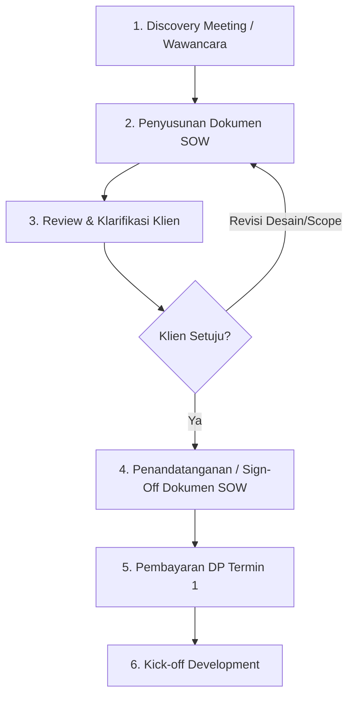

# STANDARD OPERATING PROCEDURE (SOP)
## SOP-01: Pemetaan Kebutuhan, Scope of Work (SOW), dan Persetujuan Klien

**Kode Dokumen:** SOP-JD-001  
**Divisi:** Engineering & Client Management  
**Entitas:** JohnDev Technology Solution  
**Versi:** 1.0 (Efektif Oktober 2026)  

---

### 1. TUJUAN (OBJECTIVE)
1. Mencegah terjadinya *scope creep* (permintaan penambahan fitur tanpa batas yang merugikan developer).
2. Memastikan pemahaman alur kerja antara calon klien dan tim JohnDev selaras secara tertulis.
3. Menjadi dasar acuan hukum dan teknis yang mengikat sebelum kode program mulai ditulis.

---

### 2. RUANG LINGKUP (SCOPE)
Berlaku untuk seluruh proyek rekayasa perangkat lunak (Point of Sale, ERP, Web Application, Mobile Application, dan Integrasi Hardware) yang dikerjakan oleh JohnDev.

---

### 3. TAHAPAN PELAKSANAAN



#### Langkah 1: Discovery & Wawancara Kebutuhan
* Tim JohnDev melakukan wawancara langsung (kunjungan lokasi) atau daring (Google Meet/Zoom) dengan pengambil keputusan klien.
* Menggali minimal 4 poin fundamental:
  1. Siapa saja pengguna sistem (kasir, gudang, admin, manajer)?
  2. Data apa saja yang masuk dan laporan apa yang harus keluar?
  3. Apakah ada perangkat keras khusus (printer thermal, barcode scanner, timbangan)?
  4. Apakah ada integrasi sistem pihak ketiga (WhatsApp API, payment gateway)?

#### Langkah 2: Penyusunan Dokumen Scope of Work (SOW)
Tim JohnDev menyusun dokumen spesifikasi kebutuhan yang memuat:
1. **In-Scope (Fitur yang Dikerjakan):** Daftar modul secara detail (contoh: CRUD master data produk, cetak nota 58mm/80mm, dashboard omset harian).
2. **Out-of-Scope (Fitur yang TIDAK Dikerjakan):** Hal-hal yang secara tegas tidak termasuk dalam kontrak (contoh: belum mencakup multi-gudang, belum termasuk aplikasi iOS, tidak termasuk pengadaan perangkat komputer/printer fisik).
3. **Batasan Revisi Desain UI/UX:** Maksimal 2 (dua) kali revisi pada tahap *wireframe* / antarmuka sebelum koding dimulai.

#### Langkah 3: Sign-Off (Persetujuan Resmi Klien)
* Dokumen SOW dikirimkan ke klien dalam bentuk PDF atau formulir digital.
* Klien wajib memberikan persetujuan tertulis (tanda tangan dokumen atau konfirmasi formal via WhatsApp/Email resmi yang tercatat).
* **Aturan Mutlak:** Pengerjaan koding **DILARANG DIMULAI** sebelum dokumen SOW disetujui dan pembayaran Termin 1 (DP) masuk.

---

### 4. LAMPIRAN: TEMPLATE FORMULIR PERSETUJUAN (SIGN-OFF FORM)

```markdown
================================================================================
                    LEMBAR PERSETUJUAN SPESIFIKASI PROYEK (SOW)
================================================================================
Nama Proyek          : [Contoh: Sistem POS & Inventori Toko Berkah]
Nama Klien / Badan   : [Nama Perusahaan / Pemilik]
Kontak / WhatsApp    : [Nomor Kontak]
Tanggal Efektif      : [DD/MM/YYYY]

RINGKASAN MODUL TERMASUK (IN-SCOPE):
1. Modul Kasir & Cetak Struk Thermal (Bluetooth/USB)
2. Manajemen Stok Barang & Peringatan Stok Minimum
3. Dashboard Ringkasan Penjualan & Laporan Laba Kotor
4. Hak Akses 2 Peran: Kasir dan Pemilik (Owner)

BATASAN YANG TIDAK TERMASUK (OUT-OF-SCOPE):
1. Pengadaan perangkat keras (laptop, printer, tablet dibeli mandiri oleh klien).
2. Biaya sewa cloud hosting/VPS dan langganan domain tahunan.
3. Integrasi ke marketplace (Shopee/Tokopedia) belum termasuk.

BATASAN REVISI:
- Revisi desain tampilan: Maksimal 2 (dua) kali perbaikan minor.
- Permintaan fitur di luar daftar di atas akan dihitung sebagai Addendum (Change Request).

Dengan menandatangani formulir ini, Klien menyetujui ruang lingkup pekerjaan
dan menjadi acuan resmi pengerjaan oleh tim JohnDev.

Pihak Klien,                                     Pihak JohnDev,


( _______________________ )                      ( _______________________ )
Tanggal:                                         Tanggal:
================================================================================
```
